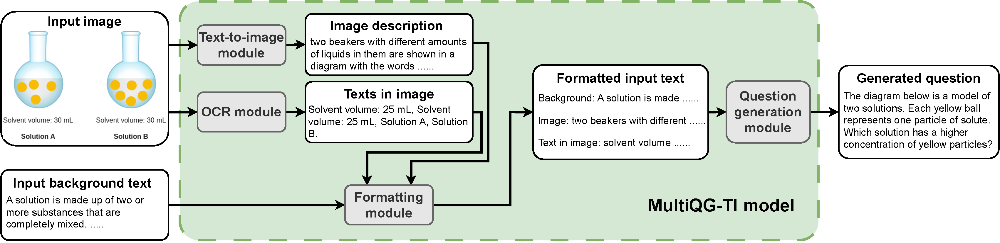

# Code for the submission "MultiQG-TI: Towards Question Generation from Multi-modal Sources"

  

This repository contains the code for the BEA 2023 submission `MultiQG-TI: Towards Question Generation from Multi-modal Sources`

## Requirements
- pytorch
- pytorch_lightning
- transformers
- evaluate
- tensorflow
- sentence_transformers
- faiss
- openai

## Code organization
- Code for MultiQG using Flan-T5
  - `QG-T5-train.py`: the main training script
  - `QG-T5-inference.py`: the main inference (generation) script
  - `QG-T5-scoring.py`: the main scoring script with the eval metrics
- Code for MultiQG using OpenAI API
  - `QG-openai-inference.py`: the main inference (generation) script
  - `QG-openai-scoring.py`: the main scoring script
- Utilities
  - `utils_model.py`: model utilities for Flan-T5
  - `utils_dataset.py`: dataset utilities, including preprocessing steps
  - `utils.py`: other misc utilities including seeding and perplexity computation
- Scripts
  - `utils_script_similarity.py`: script to compute the cosine similarity to select examples for ChatGPT few-shot in-context learning
  - `download_dataset.sh`: script to download the ScienceQA dataset
  - `generated_description_from_img.py`: script to generated description from image
  - `extract_text_from_img.py`: script to extract the texts from the image

## How to reproduce
1. Produce the image descriptions
    - We already included the generated image descriptions and the extracted texts in images in `/generated_descriptions` and `/extracted_texts_img`, respectively
    - To produce the above on your own, you can run:
        - `python extract_text_from_img.py`, and 
        - `python generate_description_from_img.py`
1. Run the Flan-T5 train, generation, and scoring scripts:
    - `python QG-T5-train.py`
    - `python QG-T5-inference.py`
    - `python QG-T5-scoring.py`
    - Please refer to each script for the many configurable options
1. Run the OpenAI generation and scoring scripts
    - Fill in the OpenAI API key in the `QG-openai-inference.py` script
    - `python QG-openai-inference.py` 
    - `python QG-openai-scoring.py`
